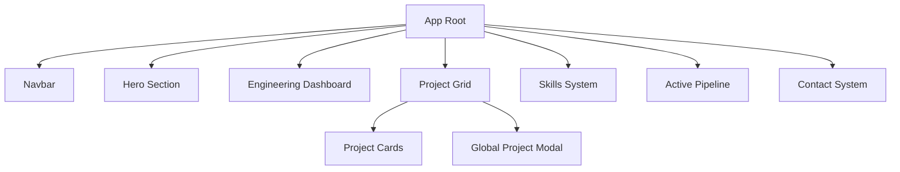

# EXCODE Portfolio V3.1 — Architectural Blueprint

## Core Philosophy
The EXCODE Portfolio is a high-authority engineering platform designed to showcase technical mastery, system operational depth, and architectural precision. It prioritizes information density and operational realism over decorative aesthetics.

## Branding Hierarchy
1. **Primary Entity**: MIZ (The Engineer)
2. **Ecosystem**: EX CODE (Engineering Infrastructure)
3. **Products**: Sentinel, AI Utilities, etc.

---

## 1. System Structure

---

## 2. Data Engine (V3 Schema)
Located in `src/data/projects.js`.
Every project object is a "System Module" with:
- **Telemetry**: Modules, DB, Auth, Architecture types.
- **Proof**: Engineering notes, Challenges, Solutions.
- **Architecture**: Step-by-step infrastructure flow.
- **Timeline**: Start/Update dates + Completion metrics.

---

## 3. Engineering Command Interface (Modal)
The `ProjectModal.jsx` is the core deep-dive component.
- **Layer 1**: Hero Banner (System Status & Brand).
- **Layer 2**: Telemetry Panel (Infrastructure Metrics).
- **Layer 3**: Architecture Flow (Engineering logic visualization).
- **Layer 4**: Problem/Solution matrices (Senior-level proof).

---

## 4. Responsive Strategy
- **Mobile First**: All components use `clamp()` and flex/grid systems.
- **Performance**: Motion reduction via `prefers-reduced-motion`.
- **Optimization**: `will-change` properties on heavy animation nodes.

---

## 5. Deployment & Uptime
- **Status**: V3.1-EVO
- **Environment**: Production Hardened
- **Telemetry**: Real-time dashboard powered by `src/config/systemStatus.js`.
